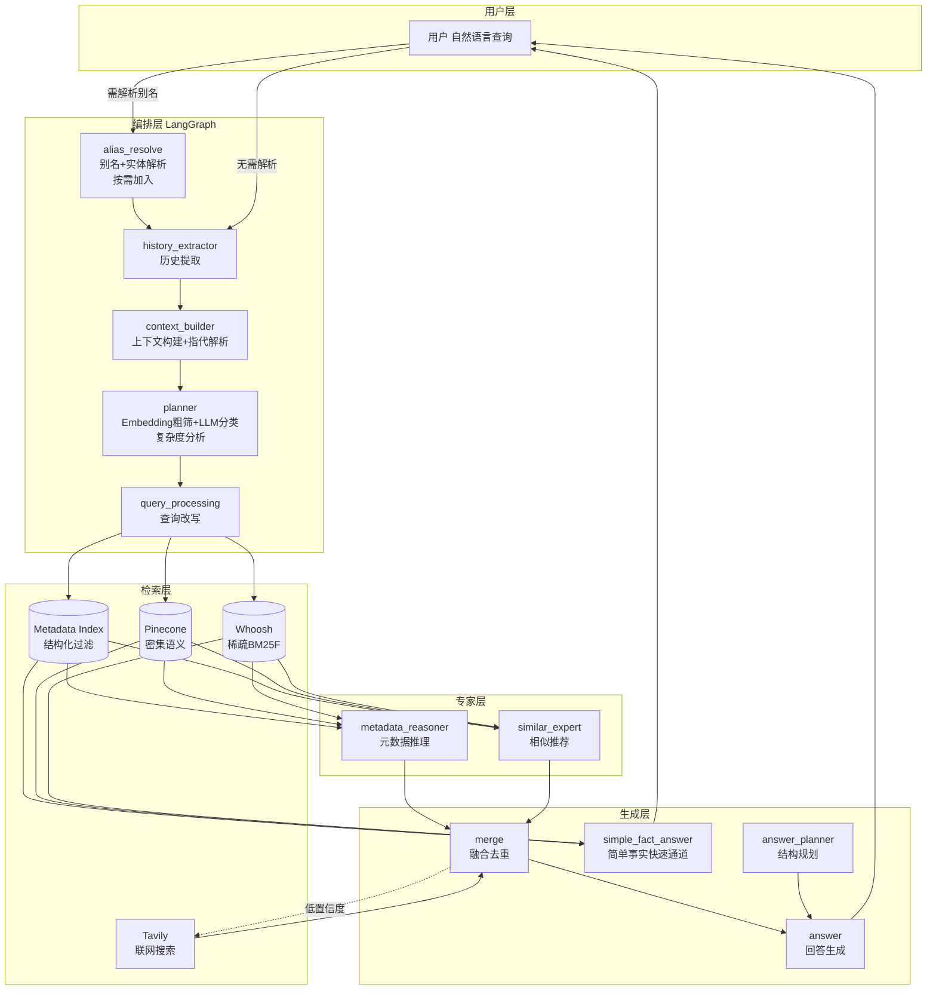
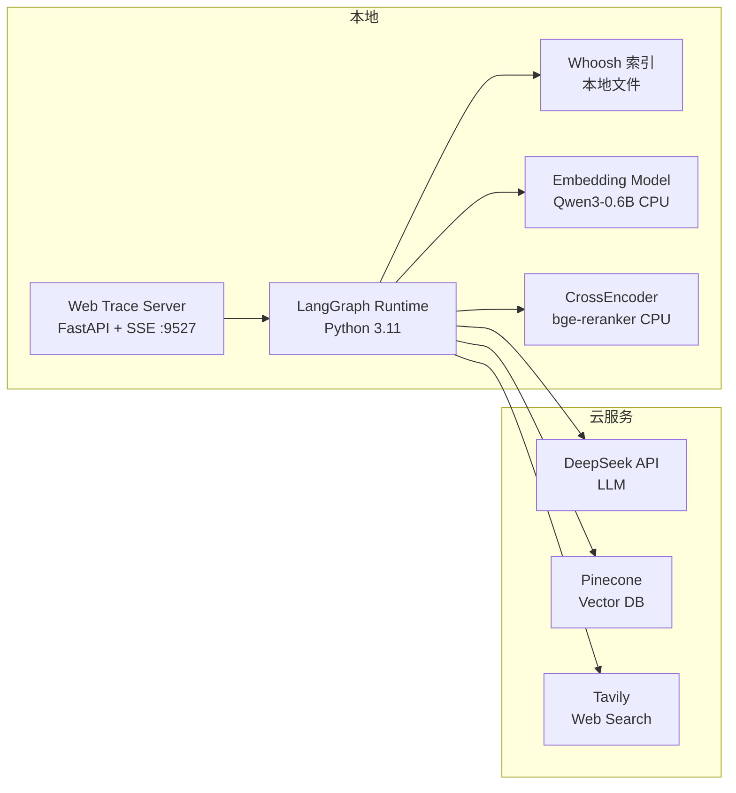
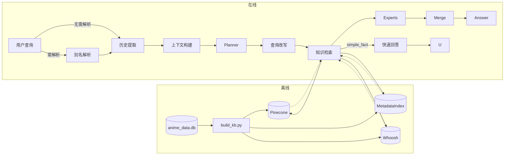
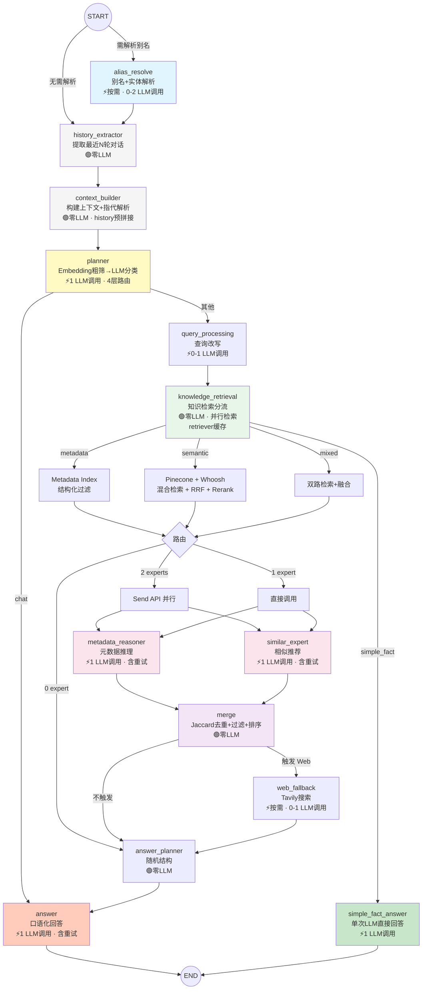
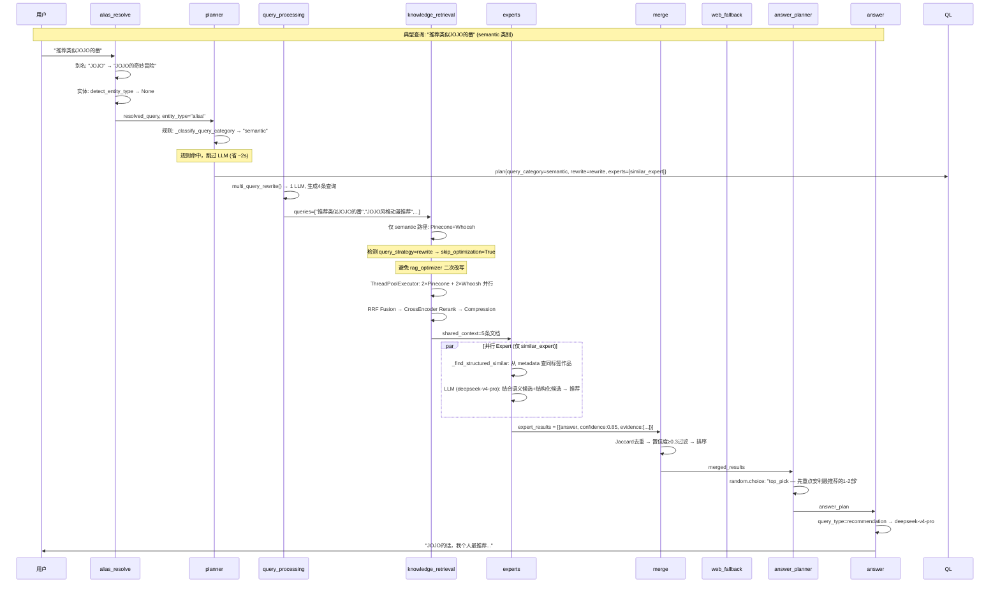

# ACG 番剧推荐 - LangGraph 多智能体系统项目总结

> **文档版本**: v2.3 (异步并行 + 健壮性 + 正确性修复)  
> **更新日期**: 2026-07-16  
> **适用范围**: 项目交接、团队协作、后续迭代参考  
> **项目定位**: 面向动漫推荐场景的 Hybrid RAG + Multi-Agent 智能推荐系统

---

## 目录

1. [项目概述](#1-项目概述)
2. [系统架构](#2-系统架构)
3. [Design Decisions（设计决策）](#3-design-decisions设计决策)
4. [知识库搭建](#4-知识库搭建)
5. [Graph 图结构设计](#5-graph-图结构设计)
6. [RAG 全链路设计](#6-rag-全链路设计)
7. [提示词工程](#7-提示词工程)
8. [可观测性](#8-可观测性)
9. [测试体系](#9-测试体系)
10. [创新设计](#10-创新设计)
11. [异常与边界处理](#11-异常与边界处理)
12. [Future Work](#12-future-work)
13. [Lessons Learned（经验教训）](#13-lessons-learned经验教训)
14. [附录](#14-附录)

---

## 1. 项目概述

> **本章目标**: 3 分钟了解项目全貌——做什么、用什么做、做到什么程度。

### 1.1 一句话定位

面向动漫推荐场景的 **Hybrid RAG + Multi-Agent 智能推荐系统**，基于 LangGraph 编排多个专业 Agent 协作，在 ~5,000 部番剧知识库上实现秒级自然语言问答。

### 1.2 业务目标

| 场景 | 示例查询 | 处理路径 |
|------|----------|----------|
| 智能推荐 | "推荐类似JOJO的番" | semantic → Pinecone+Whoosh → similar_expert |
| 事实查询 | "京都动画有哪些作品" | metadata → MetadataIndex → simple_fact_answer (快速通道) |
| 简单事实 | "夏亚是谁"、"素晴评分" | metadata → MetadataIndex → simple_fact_answer |
| 对比分析 | "巨人vs鬼灭哪个好看" | mixed → 双路检索 → 双Expert并行 |
| 实体解析 | "夏亚是谁" | entity_resolver → L0/L1/L2 映射 |
| 梗解释 | "典明粥是什么梗" | L0字典命中 → 直接映射 |
| 多轮追问 | "推荐JOJO" → "它的评分" | context_builder 指代解析 → 消费历史 |

### 1.3 技术栈

| 层级 | 技术选型 | 选型理由 |
|------|----------|----------|
| 智能体框架 | LangGraph 0.3+ | 状态机可维护、Send API 原生支持并行 |
| 主 LLM | DeepSeek-V4-Pro (DeepSeek) | 中文 ACG 领域理解能力强、API 稳定 |
| 轻量 LLM | DeepSeek-V4-Flash (DeepSeek) | 简单事实查询快速通道、降低延迟 |
| 向量检索 | Pinecone (MMR) | 托管服务、零运维、MMR 保证多样性 |
| 稀疏检索 | Whoosh (BM25F) | 本地部署、零网络延迟、中文分词友好 |
| 精排 | bge-reranker-v2-m3 | SOTA 中文 CrossEncoder、CPU 可用 |
| 嵌入模型 | Qwen3-Embedding-0.6B | 1024 维、本地 CPU 运行、零 API 费用 |
| 结构化索引 | JSON MetadataIndex | 内存查找 O(1)、支持多维过滤 |
| 联网搜索 | Tavily | 按需触发、成本可控 |

### 1.4 核心功能边界

**覆盖**: 番剧推荐、事实查询、对比分析、角色/梗→番剧映射、昵称解析、多轮追问、闲聊  
**不覆盖**: 用户画像、实时播放链接、非 ACG 领域、长期记忆

**关键结论**: 系统采用"Embedding 粗筛 + LLM 精分类"双层分类设计，先通过 embedding 质心匹配过滤明显不相关类别，再由 LLM 分析查询复杂度决定是否需要多查询扩展，按需路由 alias_resolve 和 web_fallback。

---

## 2. 系统架构

> **本章目标**: 理解系统的三层架构和宏观数据流。

### 2.1 系统总体架构图



### 2.2 部署架构图



### 2.3 数据流图



---

## 3. Design Decisions（设计决策）

> **本章目标**: 理解每个关键技术选型背后的"为什么"，方便新成员快速对齐设计理念。

### 3.1 为什么选择 LangGraph 而非 LCEL / AutoGen

| 方案 | 优点 | 缺点 | 结论 |
|------|------|------|------|
| **LCEL** (LangChain Expression Language) | 简洁、链式调用直观 | 复杂路由困难、无原生并行、状态管理弱 | 不适合多分支条件路由场景 |
| **AutoGen** | Agent 生态丰富、对话模式成熟 | 可控性一般、调试困难、中文支持弱 | 过度灵活导致行为不可预测 |
| **LangGraph** ✅ | 状态机可维护、Send API 原生并行、Streaming 支持 | 开发复杂度较高、文档迭代快 | 本项目需要可控工作流 + 并行 Expert，最佳选择 |

**Trade-off**: 选择 LangGraph 意味着接受更高的学习曲线，换取精确的流程控制和可维护性。

### 3.2 为什么使用 Hybrid RAG (Dense + Sparse + Structured)

| 维度 | Dense (Pinecone) | Sparse (Whoosh) | Structured (MetadataIndex) |
|------|------------------|-----------------|---------------------------|
| 适合 | 语义相似推荐 | 精确名称/标签匹配 | 结构化过滤 (评分/年份/公司) |
| 不适合 | 精确数值比较 | 抽象语义查询 | 自由文本描述 |
| 互补 | 覆盖"像 XX 的番" | 覆盖"XX 公司作品" | 覆盖"8分以上的热血番" |

**关键发现**: 纯 Embedding 检索对"京都动画有哪些作品"这类查询效果差（Embedding 不理解"制作公司"属性），必须引入结构化索引。

### 3.3 为什么 Planner 使用 Embedding 粗筛 + LLM 精分类

| 阶段 | 策略 | LLM 调用 | 说明 |
|------|------|:---:|------|
| v0 (全 LLM) | 所有查询调 LLM Planner | 4-6 次 | 成本高、延迟大 |
| v1 (规则优先) | 正则 + 实体标记分类 | 0-1 次 | 规则维护困难、边缘 case 误判 |
| v2 (LLM 分类) | simple_LLM 一次分类 | 1 次 | 精确可靠、无正则维护 |
| v2.2 (双层分类) ✅ | Embedding 粗筛 + LLM 精分类 | 1 次 | 先过滤不相关类别，再分析复杂度决定扩展策略 |

**4 层路由流程**:
1. **Embedding 预过滤**: 查询 embedding 与 4 类别质心计算余弦相似度，排除低于阈值的类别
2. **分类缓存**: 相似历史查询命中则直接复用缓存结果
3. **LLM 意图分类**: `_classify_intent()` 在排除后的类别中做精确分类
4. **复杂度分析**: LLM 判断查询是否需要多查询扩展（rephrase/hyde/decompose）

**Trade-off**: 比纯 LLM 分类多一次 embedding 计算（~50ms 本地 CPU），但排除了不相关类别减少了 LLM prompt 中的分类候选，提升了准确率。

### 3.4 为什么使用两个 Expert 并行而非单一 Agent

| 方案 | 优点 | 缺点 |
|------|------|------|
| 单 Agent | 简单 | 不同维度信息混杂，prompt 过长 |
| 双 Expert 并行 ✅ | 职责清晰、独立置信度、可分别优化 | 需要 Merge 节点融合 |

### 3.5 Fusion 算法选择 RRF 而不是加权

| 算法 | 原理 | 优点 | 缺点 |
|------|------|------|------|
| **RRF** ✅ | score = Σ 1/(60+rank) | 无需归一化、对排名稳定 | 忽略原始分数幅度 |
| Weighted | score = 0.7×dense + 0.3×sparse | 可调权重 | 得分尺度不同需归一化 |
| Max | score = max(dense, sparse) | 简单 | 丢失互补信息 |

**选择 RRF 的原因**: Dense (Pinecone) 和 Sparse (Whoosh) 的分数尺度完全不同（余弦相似度 vs BM25），RRF 通过排名融合规避了归一化问题。

### 3.6 为什么 CrossEncoder 默认启用但推荐关闭

| 场景 | 收益 | 成本 |
|------|------|------|
| 候选文档多 (>10) | 排序质量提升明显 | CPU ~300ms |
| 候选文档少 (≤5) | 收益递减，RF 已足够 | CPU ~50ms |

**结论**: 通过 `ENABLE_RERANKING=false` 可按需关闭，候选少时自动跳过。

### 3.7 为什么节点分为必备和按需

| 分类 | 节点 | 触发条件 |
|------|------|----------|
| **必备** | history_extractor, context_builder, planner, query_processing, knowledge_retrieval, merge, answer_planner, answer | 每次查询都执行 |
| **按需** | alias_resolve | `_should_skip_alias()` 预检：查询无别名特征时跳过 |
| **按需** | metadata_reasoner, similar_expert | Planner 根据查询意图决定启用 |
| **按需** | web_fallback | 低置信度 / 检索无结果时触发 |
| **按需** | simple_fact_answer | `plan.query_type == "simple_fact"` 时走快速通道 |

**实现方式**:
- `alias_resolve`: 通过 `START` 节点的条件边 `_route_from_start()` 实现按需路由
- `web_fallback`: 通过 `ToolRegistry.is_enabled("search_web")` + `config.ENABLE_WEB_SEARCH` 双重开关控制
- 减少不必要的 LLM 调用（alias_resolve 在纯闲聊时可跳过），降低延迟和成本

### 3.8 为什么使用 ToolRegistry 统一工具注册

| 方案 | 优点 | 缺点 |
|------|------|------|
| 分散 import | 简单 | 工具散落各处、依赖关系不清晰、难做开关控制 |
| ToolRegistry ✅ | 集中管理、懒加载、统一开关控制 | 需要额外注册代码 |

**ToolRegistry 覆盖**: 2 个 LLM 工具 + 9 个 pipeline 工具 + 1 个 debug 工具，支持 `import_path` 懒加载，通过 `is_enabled()` 控制工具启用/禁用。

**Trade-off**: 多一层抽象但实现了工具的全生命周期管理（注册 → 懒加载 → 调用 → 开关控制），web_fallback 和 planner 不再直接 import 工具函数。

---

## 4. 知识库搭建

> **本章目标**: 了解数据从 Bangumi 到 Pinecone/Whoosh/MetadataIndex 的完整链路。

### 4.1 数据源

**主数据源**: BangumiCrawler 爬取的 SQLite 数据库 (`data/anime_data.db`)

- 番剧总数: ~5,003 部，覆盖 2000-2025 年
- 数据维度: 基本信息、标签分类、制作公司、导演、编剧、声优、用户评论

| 表名 | 内容 |
|------|------|
| `Anime` | id, title, title_cn, score, score_count, release_date, summary |
| `Category` / `Anime_Category` | 标签/分类 |
| `Production` / `Anime_Production` | 制作公司 |
| `Director` / `Anime_Director` | 导演 |
| `Writer` / `Anime_Writer` | 编剧 |
| `Seiyuu` / `Anime_Seiyuu` | 声优 |
| `Comments` | 用户评论 (每部最多5条) |

### 4.2 文本构造策略

**单 chunk 策略**（每部番剧一个文本块）:

```text
番剧名称: {title} ({title_cn})
评分: {score} / 10.0 ({score_count}人评价)
播出日期: {date}
标签: {tag1}, {tag2}, {tag3}
制作: {studio}
导演: {director}
编剧: {writer}
声优: {seiyuu1}, {seiyuu2}
观众评论: {comment1} | {comment2} | ...
```

**Trade-off**: 单 chunk 策略避免了片段语义断裂（番剧信息本身就是完整单元），但长文本可能超出 Embedding 模型的上下文窗口。评论按字数截断作为补偿。

### 4.3 三套索引并行构建

| 索引 | 类型 | 存储 | 用途 |
|------|------|------|------|
| **Pinecone** | 1024 维密集向量 | 云端 | 语义相似推荐 |
| **Whoosh** | BM25F 稀疏倒排 | 本地文件 | 精确名称/关键词匹配 |
| **MetadataIndex** | JSON 结构化 | 本地内存 | 多维过滤查询 |

**构建命令**:
```bash
python data/build_kb.py                 # 全部构建
python data/build_kb.py --resume         # 断点续跑
python data/build_kb.py --metadata-only  # 仅 JSON
python data/build_kb.py --whoosh-only    # 仅 Whoosh
```

**构建配置**:
- BATCH_SIZE = 10（每批嵌入条数）
- SAVE_INTERVAL = 20（每多少条保存 checkpoint）
- 嵌入模型: Qwen3-Embedding-0.6B (1024维) 或 text-embedding-v4
- Whoosh 分析器: 中文+英文分词 `RegexAnalyzer(r"[\u4e00-\u9fff]+|[a-zA-Z0-9]+")`

### 4.4 更新维护

- 支持 `--resume` 断点续跑
- `MetadataIndex.reload()` 支持热更新
- 目前无增量更新机制，需全量重建

**关键结论**: 三套索引各司其职，覆盖了精确、语义、结构化三种查询模式。

---

## 5. Graph 图结构设计

> **本章目标**: 理解 LangGraph 状态图的完整节点定义、数据流和路由逻辑。

### 5.1 整体流程图



> 图例: 🟢 = 零 LLM 成本 | ⚡ = 含 LLM 调用 | 按需 = 条件触发

### 5.2 节点详细定义

| 节点 | 文件 | 输入 | 输出 | LLM调用 | 模型 | 可缓存 | 分类 |
|------|------|------|------|:---:|------|:---:|:---:|
| alias_resolve | graph.py | messages, original_query | resolved_query, entity_* | 0-2 (按需) | deepseek-v4-flash | ✅ LRU(128) | 按需 |
| history_extractor | history_extractor.py | messages | context.history | 0 | - | ❌ | 必备 |
| context_builder | context_builder.py | context.history, recent_entities, entity_* | context, resolved_query, history_text, history_text_recent | 0 | - | ❌ | 必备 |
| planner | planner.py | original_query, entity_*, context, history_text | plan | **1 (含重试)** | deepseek-v4-flash | ❌ | 必备 |
| query_processing | graph.py | plan, resolved_query | shared_context(查询) | 0-1 | deepseek-v4-pro | ✅ MD5(500) | 必备 |
| knowledge_retrieval | graph.py | plan, shared_context | metadata, shared_context(文档) | 0 | - | ✅ lru_cache (retriever) | 必备 |
| simple_fact_answer | simple_fact_answer.py | metadata, original_query, entity_*, history_text_recent | messages, recent_entities | **1 (含重试)** | simple_LLM | ❌ | 按需 |
| metadata_reasoner | metadata_reasoner.py | resolved_query, metadata, shared_context | expert_results | 1 (含重试) | deepseek-v4-pro / simple_LLM | ❌ | 按需 |
| similar_expert | similar_expert.py | resolved_query, metadata, shared_context | expert_results | 1 (含重试) | deepseek-v4-pro / simple_LLM | ❌ | 按需 |
| merge | merge.py | expert_results | merged_results | 0 | - | ❌ | 必备 |
| web_fallback | web_fallback.py | original_query, merged_results | merged_results(追加) | 0-1 (按需) | deepseek-v4-flash | ❌ | 按需 |
| answer_planner | graph.py | plan | answer_plan | 0 | - | ❌ | 必备 |
| answer | answer.py | original_query, plan, merged_results, context, history_text_recent | messages, recent_entities, previous_intent | 1 (含重试) | deepseek-v4-pro/deepseek-v4-flash | ❌ | 必备 |

### 5.3 State Schema

#### AgentState (TypedDict)

```python
class AgentState(TypedDict):
    # 对话
    messages: Annotated[List[BaseMessage], add_messages]

    # 规划
    plan: dict                        # ExecutionPlan
    answer_plan: dict                 # 回答结构指引

    # 检索结果
    metadata: list[dict]              # MetadataIndex 结构化结果
    shared_context: list[str]         # Pinecone/Whoosh 文档 (queries→docs 复用字段)

    # Expert 输出 (reducer: operator.add 实现并行合并)
    expert_results: Annotated[list[dict], add]
    merged_results: str               # Merge 后文本

    # 查询
    original_query: str
    resolved_query: str               # 别名解析后
    search_keywords: list[str]        # 提取的番剧名

    # 实体
    entity_type: str                  # character | meme | alias | ""
    entity_name: str
    entity_anime: str
    entity_confidence: float
    entity_source: str                # dict | llm | web

    # 优化标记
    query_strategy: str               # direct | rewrite | hyde | decompose
    optimized_queries: list[str]      # 上游已优化查询

    # 缓存 (跨节点复用)
    metadata_cache: dict
    alias_cache: dict

    # ── 对话上下文 (v1.1) ──
    context: ConversationContext       # 当前轮上下文
    recent_entities: list[dict]        # 持久化: 最近讨论的实体
    previous_intent: str               # 持久化: 上一轮意图
```

#### ConversationContext (TypedDict — v1.1 新增, v2.2 扩展)

```python
class ConversationContext(TypedDict):
    history: list[dict]             # 最近 N 轮: [{user, assistant}]
    recent_entities: list[dict]     # 最近实体: [{name, type}]
    current_topic: str              # 当前话题
    is_followup: bool               # 是否为追问
    resolved_query: str             # 指代解析后的查询
    previous_intent: str            # 上一轮意图
    history_text: str               # v2.2: 完整对话历史文本（给 planner）
    history_text_recent: str        # v2.2: 最近3轮截断文本（给 answer/simple_fact_answer）
```

**history_text 分版策略**: 完整版供 planner 做意图分类，截断版（最近3轮=6行）防止 answer 节点上下文过长、token 膨胀。

#### ExecutionPlan (Pydantic — Graph 路由的核心驱动力)

```python
class ExecutionPlan(BaseModel):
    query_type: str        # simple_fact | recommendation | comparison | chat
    alias_resolved: bool   # 别名是否已解析
    rewrite_strategy: str  # direct | rewrite | hyde | decompose
    experts: list[str]     # ["metadata_reasoner"] | ["similar_expert"] | 两者
    parallel: bool         # Send API 并行
    query_category: str    # metadata | semantic | mixed (检索路径)
    need_web: bool         # 低置信度/梗实体时强制触发 Web Fallback
    reasoning: str
```

#### ExpertResult (统一 Expert 输出格式)

```python
class ExpertResult(BaseModel):
    answer: str            # 分析结论
    confidence: float      # 0.0-1.0
    evidence: list[str]    # 依据来源
```

### 5.4 路由逻辑

| 路由点 | 函数 | 逻辑 |
|--------|------|------|
| START 后 | `_route_from_start` | 含别名特征 → alias_resolve，否则跳过直达 history_extractor |
| Planner 后 | `_route_after_planner` | chat → answer，其余 → query_processing |
| 检索后 | `_route_after_retrieval` | simple_fact → simple_fact_answer；0 Expert → answer_planner；1 Expert → 直接边；2 Experts → Send 并行 |
| Merge 后 | `_route_after_merge` | need_web 或 无结果 或 低置信度 → web_fallback，否则 answer_planner |

**关键结论**: Graph 通过 ExecutionPlan 驱动全部路由，simple_fact 走快速通道跳过 Expert+Merge+Answer 三步，alias_resolve 和 web_fallback 按需触发。

---

## 6. RAG 全链路设计

> **本章目标**: 理解用户查询如何变成精准回答的完整数据流。

### 6.1 完整时序图



### 6.2 查询改写 (Query Processing)

| 策略 | 触发条件 | 操作 | LLM | Token 消耗 |
|------|----------|------|-----|:---:|
| `direct` | 闲聊/短查询/纯 metadata | 原样透传 | 0 | 0 |
| `rewrite` | 默认 | 从3个视角生成改写查询 | 1 (deepseek-v4-pro t=0.7) | ~500 |
| `hyde` | 深度评价类 ("为什么""好在哪") | 生成假设性答案作为检索文本 | 1 (deepseek-v4-pro t=0.8) | ~800 |
| `decompose` | 含多个子问题 ("分别""还有") | 拆分为独立子问题 | 1 (deepseek-v4-pro t=0.5) | ~400 |

**缓存**: MD5 前缀内存 dict (max 500) + `@lru_cache(256)` 双重缓存，热点查询秒级命中。

### 6.3 Hybrid Retrieval

#### 路径选择 (由 Planner 的 query_category 决定)

| query_category | Metadata Index | Pinecone + Whoosh | 示例查询 |
|:---:|:---:|:---:|------|
| `metadata` | ✅ | ❌ | "京都动画有哪些作品" |
| `semantic` | ❌ | ✅ | "推荐类似进击的巨人的番" |
| `mixed` | ✅ | ✅ | "推荐热血动作番剧评分高一点" |

#### Hybrid 检索管线参数

| 步骤 | 方法 | 参数 | 成本 |
|------|------|------|------|
| 密集检索 | Pinecone MMR | k=10, fetch_k=20, λ=0.7 | ~200ms API |
| 稀疏检索 | Whoosh BM25F | k=10, OrGroup | ~10ms 本地 |
| 并行 | ThreadPoolExecutor | workers=min(2q, 8) | - |
| 融合 | RRF | 60+k 平滑 | <0.1ms |
| 精排 | CrossEncoder | bge-reranker-v2-m3 | ~300ms CPU |
| 压缩 | trigram Jaccard + 截断500 | k_final=5 | <1ms |

#### Token 流向

```
用户查询 (50 tokens)
  ↓ query_processing
改写查询 (200 tokens / 4条)
  ↓ 并行检索
Pinecone docs (5000 tokens / 10条)
Whoosh docs (3000 tokens / 10条)
  ↓ RRF Fusion
融合文档 (5000 tokens)
  ↓ CrossEncoder Rerank
精排文档 (3000 tokens / 前10条)
  ↓ Compression
最终5条 (1500 tokens)
  ↓ Expert context (截断2000字符)
Expert input (~2500 tokens)
  ↓ Merge
merged_results (~1500 tokens)
  ↓ Answer
最终回答 (~500 tokens)
```

### 6.4 双重查询优化消除

原始 v0 流程存在 **二次改写** 问题：

```
query_processing → rewrite (1 LLM, 4 queries)
  → retrieve_with_optimization(q1) → classify + rewrite (1 LLM, 4 queries) → 4×Pinecone
  → retrieve_with_optimization(q2) → classify + rewrite (1 LLM, 4 queries) → 4×Pinecone
合计: 3 LLM + 8 Pinecone + 8 Whoosh
```

优化后 v1:

```python
# graph.py: query_processing 输出标记
return {"query_strategy": strategy, "optimized_queries": queries}

# graph.py: knowledge_retrieval 读标记
already_optimized = state.get("query_strategy") in ("rewrite", "hyde", "decompose")

# rag_optimizer.py: retrieve_with_optimization 跳过
def retrieve_with_optimization(..., skip_optimization: bool = False):
    if skip_optimization:
        queries = [search_query]  # 直接用原查询，不再 rewrite
```

**收益**: LLM 调用 -1~2次 (~2s), Pinecone 调用 8→2次 (~1s), Whoosh 调用 8→2次。

---

## 7. 提示词工程

> **本章目标**: 理解系统 Prompt 的设计规范和迭代历史。

### 7.1 提示词体系全景

| 节点 | 角色 | 模型 | 温度 | 输出格式 | 核心约束 |
|------|------|------|:---:|------|------|
| Planner | 规划师 | deepseek-v4-flash | 0.3 | JSON | 分类+策略+专家选择 |
| Metadata Reasoner | 元数据专家 | deepseek-v4-pro | 0.7 | JSON | 证据导向、引用评论、不编造 |
| Similar Expert | 推荐专家 | deepseek-v4-pro | 0.7 | JSON | 多维度、引用评论、口语化 |
| Answer (复杂) | 回答者 | deepseek-v4-pro | 0.7 | 自然语言 | 只重组不创造、换花样、反AI套话 |
| Answer (简单) | 回答者 | deepseek-v4-flash | 0.7 | 自然语言 | 同上 |
| 别名/实体 | 解析器 | deepseek-v4-flash | 0.5 | 纯文本/JSON | 简短输出、置信度标注 |

### 7.2 Answer 提示词迭代历史

| 版本 | 问题 | 优化 | 效果 |
|------|------|------|------|
| v1 | AI 套路化严重 ("推荐理由""值得注意的是") | 放宽约束 | 改善有限 |
| v2 | 证据不足空洞 | Expert 增加 evidence 字段 | 回答更扎实 |
| v3 | 结构单调 | 引入 Answer Planner 随机结构 | 每次回答结构不同 |
| v4 | 仍偏正式 | 角色改为"跟朋友聊番"、禁止词清单 | 自然度大幅提升 |

### 7.3 设计原则

1. **角色先行**: 每个提示词明确角色定位（不是通用 AI，是资深二次元）
2. **严格输出格式**: 中间节点 JSON，最终节点自然语言
3. **反幻觉约束**: "只重组不创造""不确定的直接说"
4. **证据驱动**: Expert 必须引用 evidence，Answer 从 evidence 提取
5. **多样性**: Answer Planner 随机化避免固定模板

**关键结论**: v4 回答自然度显著提升，关键改动不是加约束而是**改角色定位和禁止词清单**。

---

## 8. 可观测性

> **本章目标**: 了解系统的监控、日志和调试手段。

### 8.1 Web Trace 面板

**文件**：`server.py` + `static/` + `trace/`

基于 FastAPI + SSE（Server-Sent Events）的实时执行追踪面板，左栏聊天气泡 + 右栏流程图：

- **SSE 实时推送**：节点开始/结束、LLM Token 用量、回答文本流式传输
- **聊天气泡**：对话式 UI，打字机流式输出
- **流程图**：显示完整执行链路，每个节点标注耗时和 LLM 调用倍数
- **节点详情**：点击节点查看 State 变化、LLM 调用明细
- **模型选择**：下拉切换 deepseek-v4-pro / deepseek-v4-flash

**启动**：`python server.py` → http://localhost:9527

**trace/ 模块**：
| 文件 | 职责 |
|------|------|
| `collector.py` | 单一 `astream_events(version="v2")` 流收集所有事件（避免双流导致图执行两次） |
| `adapter.py` | LangGraph 事件 → 前端 TraceEvent 格式适配 |
| `models.py` | TraceEvent / NodeInfo / NodeRuntime / LLMTrace 类型定义 |
| `pricing.py` | DeepSeek Token 计价 |

### 8.2 LangSmith / LangFuse 追踪

```python
# config.py
LANGCHAIN_TRACING = os.getenv("LANGCHAIN_TRACING_V2", "false")
LANGFUSE_PUBLIC_KEY = os.getenv("LANGFUSE_PUBLIC_KEY")
```

- 支持 LangSmith 和 LangFuse 两种追踪方案
- 默认关闭，开发调试时手动开启
- 记录完整的 LLM 调用链、Token 消耗、延迟分布

### 8.2 日志等级设计

| 层级 | 适用范围 | 日志内容 |
|------|----------|----------|
| `INFO` | agents, tools | 检索统计、模型加载、架构初始化 |
| `DEBUG` | agents | expert state 摘要、query 处理详情 |
| `WARNING` | agents (fallback 点) | 检索失败、索引缺失、JSON 解析回退 |
| `WARNING` (全局) | openai, httpx, httpcore | 屏蔽第三方库噪音（仅 agents 内部用 INFO+） |

### 8.3 调试信息

`tools/rag_optimizer.py` 提供 `get_last_debug()` 返回最后一次检索的完整调试数据：

```python
{
    "query": "推荐热血番",
    "nickname_resolved": None,
    "classification": "rewrite",
    "optimization": "Multi-Query Rewrite",
    "rewritten_queries": [...],
    "dense_retrieved": 10,
    "sparse_retrieved": 10,
    "dense_per_query": {...},
    "fusion_strategy": "rrf",
    "post_fusion_count": 12,
    "reranking": "BAAI/bge-reranker-v2-m3 (CrossEncoder)",
    "post_rerank_count": 8,
    "compression": "8 → 5 (去重 + 截断)",
    "final_count": 5
}
```

### 8.4 Token 统计 (估算)

| LLM 调用节点 | 典型输入 | 典型输出 | 模型 |
|------|:---:|:---:|------|
| Planner (mixed) | ~500 | ~200 | deepseek-v4-pro |
| Query Rewrite | ~100 | ~150 | deepseek-v4-pro |
| Metadata Reasoner | ~2500 | ~300 | deepseek-v4-pro |
| Similar Expert | ~2500 | ~300 | deepseek-v4-pro |
| Web Fallback Extract | ~1500 | ~300 | deepseek-v4-flash |
| Answer (复杂) | ~2000 | ~500 | deepseek-v4-pro |
| Answer (简单) | ~500 | ~200 | deepseek-v4-flash |

**典型查询 Token 总量**: ~3,000-8,000 tokens / 次

---

## 9. 测试体系

> **本章目标**: 了解现有的测试覆盖和运行方式。

### 9.1 测试矩阵

| 测试文件 | 类型 | 覆盖范围 | 运行方式 |
|------|------|------|------|
| `tests/test_entity_resolver.py` | 单元测试 | 8 个 case: 角色/梗/别名解析 | `python tests/test_entity_resolver.py` |
| `tests/test_integration.py` | 集成测试 | 3 个 case: 实体解析→Planner 联动 | `python tests/test_integration.py` |
| `tests/test_agent.py` | 交互测试 | 全链路: graph 构建 + LLM 调用 | `python tests/test_agent.py` (交互) |
| `tests/check_db.py` | 健康检查 | 数据库表完整性 | `python tests/check_db.py` |
| `tests/self_check.py` | 自检 | 系统依赖完整性 | `python tests/self_check.py` |
| `data/eval_results/` | 评估报告 | 回答质量评估 | 历史运行结果 |

### 9.2 当前覆盖率

| 维度 | 覆盖 |
|------|------|
| 实体解析 | ✅ 8/8 case 通过 |
| Planner 集成 | ✅ 3/3 case 通过 |
| 全链路 | ✅ 交互式手动测试 |
| 自动回归 | ❌ 未建立 |
| 压力测试 | ❌ 未建立 |
| RAGAS 评测 | ❌ 未建立 |

### 9.3 建议补充的测试

| 优先级 | 测试类型 | 目标 |
|:---:|------|------|
| P0 | 回归测试 | 每个 PR 自动运行 entity+integration |
| P1 | 压力测试 | 并发查询下的稳定性 |
| P1 | RAGAS 评测 | 自动评估检索质量和回答准确性 |
| P2 | A/B 测试框架 | Prompt 变更效果对比 |

---

## 10. 创新设计

> **本章目标**: 提炼项目的核心技术亮点，便于答辩/分享/简历。

### 10.1 Planner LLM 分类 (LLM-First Intent Classification)

**问题**: 正则规则难以覆盖所有查询模式，"碧蓝之海怎么样？"被误判为纯 semantic（丢失 metadata 检索）。

**方案**: 全 LLM 驱动——simple_LLM 一次调用输出完整分类 JSON（query_category / query_type / strategy / experts / parallel / need_web），100% 消除正则维护。

**收益**: 意图分类准确率大幅提升，零正则维护成本，边缘 case 自动正确处理。

### 10.2 Metadata + Semantic Hybrid Retrieval

**问题**: 纯 Embedding 检索对结构化查询（"8分以上热血番"）效果差。

**方案**: 三路索引 — MetadataIndex (结构化过滤) + Pinecone (语义) + Whoosh (关键词)，分类路由。

**收益**: 结构化查询精度大幅提升，metadata 查询延迟 ~10ms (vs Pinecone ~500ms)。

### 10.3 并行 Expert (Parallel Experts via Send API)

**问题**: 单 Agent 处理不同类型信息，prompt 过长，职责混杂。

**方案**: metadata_reasoner (元数据) + similar_expert (相似推荐) 并行执行，独立置信度，Merge 融合。

**收益**: 职责清晰、可独立优化、置信度分级触发 Web Fallback。

### 10.4 Answer Planner (零 LLM 随机结构)

**问题**: 回答结构固定，用户感知"套路化"。

**方案**: 从预设结构库随机选择 (top_pick / compare / theme / honest / vs / narration)，无 LLM 成本。

**收益**: 每次回答结构不同，自然度提升，零额外成本。

### 10.5 Query Optimization Pipeline

**问题**: 原始查询覆盖面有限，检索召回率低。

**方案**: 规则分类 + Multi-Query Rewrite / HyDE / Decompose + 双重缓存。

**收益**: 检索召回率提升 (多视角覆盖)，缓存命中时零 LLM。

### 10.6 Entity Resolution (实体解析)

**问题**: "夏亚是谁" → 需要知道夏亚出自高达。

**方案**: L0 硬编码字典 (~100条目) → L1 LLM 推理 → 低置信度触发 Web。

**收益**: 角色/梗查询覆盖率从 0 到 ~70%，高置信度条目零 LLM。

### 10.7 Short-term Memory (短期对话记忆)

**问题**: 系统不支持多轮追问，"推荐JOJO" → "它的评分" 无法理解"它"指JOJO。

**方案**: 新增 history_extractor + context_builder 两个零 LLM 节点，从 messages 提取最近 N 轮对话、检测追问模式、解析代词/序号指代，生成结构化 ConversationContext。Planner 和 Answer 注入历史到 prompt。

**收益**: 支持"它"、"这部"、"第二部"、"还有吗"等多轮追问，零额外 LLM 成本。

### 10.8 Simple Fact Fast Path (简单事实快速通道)

**问题**: "谁是夏亚"走完整 metadata_reasoner → merge → answer 三步两 LLM 调用，延迟 136s。

**方案**: simple_fact 查询在知识检索后直接路由到 simple_fact_answer 节点，一次 LLM 调用同时完成分析和回答，跳过 Expert+Merge+Answer。

**收益**: 延迟从 136.8s 降至 58.0s（-57%），LLM 调用从 2 次减为 1 次。

---

## 11. 异常与边界处理

> **本章目标**: 了解系统对所有异常场景的兜底策略，确保线上稳定性。

### 11.1 LLM 调用异常

| 场景 | 策略 | 降级路径 |
|------|------|----------|
| Planner JSON 解析失败 | 回退默认计划 | `{recommendation, rewrite, 双expert}` |
| Expert JSON 解析失败 | text[:500] + conf=0.5 | still produces answer |
| 别名/实体 LLM 失败 | 静默 None | 后续节点用原始 query |
| Web Fallback 搜索失败 | 追加错误信息 | "(联网搜索失败: ...)" |
| Web Fallback 无结果 | 追加提示 | "(联网搜索未获取到有效结果)" |

### 11.2 检索异常

| 场景 | 策略 |
|------|------|
| Metadata Index 查询异常 | `logger.warning` + 空列表 |
| Pinecone/Whoosh 检索异常 | `logger.warning` + 空列表，后续触发 Web Fallback |
| shared_context 为空 | Merge 后触发 web_fallback |
| 所有 Expert 置信度 < 0.5 | 触发 web_fallback |
| Similar Expert 无候选数据 | conf=0.2 + 提示信息 |
| Merge 过滤后无结果 | "(所有 Expert 结果置信度过低)" |

### 11.3 输入边界

| 场景 | 处理 |
|------|------|
| 空查询 | `_might_be_alias()` → False → 正常流程 |
| 闲聊问候 | Planner 规则 → chat 路径 → 跳过所有 Expert |
| 非 ACG 问题 | Planner LLM → chat/unknown → 默认流程 |
| 超长查询 (含推荐词) | 跳过别名 LLM 解析 |
| 未知实体 | L1 LLM → 低置信度 → need_web=True |

### 11.4 对话管理

| 场景 | 处理 |
|------|------|
| 多轮对话 | MemorySaver 保留 messages；history_extractor + context_builder 生成 ConversationContext；Planner/Answer 消费历史上下文 |
| 指代解析 | context_builder 检测代词/序号指代 → 从 recent_entities + entity_name 解析 |
| 长文本溢出 | metadata 截断3000字符, context 截断2000字符 |
| 并发 | MemorySaver 内存，单线程无冲突 |
| 对话隔离 | 不同 thread_id 完全隔离记忆 |

### 11.5 启动检查

| 场景 | 处理 |
|------|------|
| API Key 缺失 | `config.validate()` → EnvironmentError |
| Embedding 模型未下载 | HuggingFace 自动 / dashscope 后端切换 |
| 知识库未构建 | MetadataIndex / Whoosh 加载失败 → 报错 |

---

## 12. Future Work

> **本章目标**: 展示项目的发展路线图，便于评审和资源规划。

### 12.1 已完成

| 版本 | 优化项 | 收益 |
|------|--------|------|
| v1.0 | 消除双重查询优化 | -1~2 LLM, 8→2 Pinecone |
| v1.0 | Planner 规则优先 | metadata/chat/semantic 零 Planner LLM |
| v1.0 | Answer Router | simple_fact → deepseek-v4-flash |
| v1.0 | 检索并行化 | Pinecone+Whoosh 并发 |
| v1.0 | Answer Planner | 随机结构避免套路 |
| v1.0 | 实体解析 | 角色/梗→番剧 L0+L1 |
| v1.0 | Answer 温度 0.9→0.7 | 回答更快更稳定 |
| v1.1 | 短期记忆 | history_extractor + context_builder，支持指代解析和多轮追问 |
| v1.1 | simple_fact 快速通道 | 简单查询跳过 Expert+Merge+Answer，单次 LLM 直接回答，延迟 -57% |
| v1.1 | LLM 超时 + 节点耗时日志 | request_timeout=60s，各节点输出耗时 |
| v1.1 | Planner LLM 分类 | 全面移除正则，改用 simple_LLM 一次分类 |
| v1.1 | Web Trace 面板 | FastAPI + SSE 实时执行追踪面板（聊天气泡 + 流程图） |
| v2.2 | Embedding 粗筛 | 4 类别质心匹配，过滤不相关类别，提升分类准确率 |
| v2.2 | 复杂度分析 | LLM 判断查询是否需要多查询扩展（rephrase/hyde/decompose） |
| v2.2 | 节点分类（必备/按需） | alias_resolve 和 web_fallback 按需加入，减少不必要 LLM 调用 |
| v2.2 | ToolRegistry | 统一工具注册表，12 个工具集中管理、懒加载、开关控制 |
| v2.2 | Structured Output 降级 | `invoke_structured()` 自动 JSON fallback，兼容不支持的模型 |
| v2.2 | LLM 重试 | tenacity 指数退避重试（max 2 retries），应对 API 瞬时故障 |
| v2.2 | Retriever 缓存 | `@lru_cache` 缓存 Pinecone retriever 实例 |
| v2.2 | 正则预编译 | context_builder 中 4 个正则 + 20 个序数词映射预编译为模块级常量 |
| v2.2 | history 预拼接 + 分版 | context_builder 一次性构建完整版和截断版，planner 用完整版，answer 用截断版 |
| v2.2 | history 截断修复 | answer/simple_fact_answer 仅使用最近3轮，防止 token 膨胀 |
| v2.3 | LLM 重试全覆盖 | 13 处 `llm.invoke` -> `llm_invoke_with_retry`，tenacity 覆盖所有节点 |
| v2.3 | invoke_structured 重试规范化 | 统一走 `llm_invoke_with_retry`，移除不规范的 bound method 赋值 |
| v2.3 | answer_LLM 温度修正 | 0.9 -> 0.7（与 config.ANSWER_TEMPERATURE 一致） |
| v2.3 | Planner 缓存真 LRU | OrderedDict + move_to_end，淘汰死代码 `_strategy_cache` |
| v2.3 | tag 列表统一 | 两处重复的 tag_keywords/tag_list 合并为模块级 `_ANIME_TAGS` 常量 |
| v2.3 | 正则预编译扩展 | `_extract_metadata_filters` 的 2 个正则预编译为 `_SCORE_RANGE_RE`/`_YEAR_RE` |
| v2.3 | 清理未使用配置 | 删除 MAX_ITERATIONS / ENABLE_VERIFICATION / PLANNER_MODEL / PLANNER_TEMPERATURE |
| v2.3 | 拆分 _knowledge_retrieval_node | 100 行函数拆为 3 个辅助函数 + 主编排（35 行） |
| v2.3 | 拆分 plan() | 70 行 4 层嵌套拆为 `_route_embedding` + `_route_complexity` + 主编排 |
| v2.3 | web_fallback prompt 模块级 | `_EXTRACT_PROMPT` 从函数内移到模块级 |
| v2.3 | 共享 prompt 组件 | 新建 `agents/prompts.py`，BANNED_PHRASES/INTERNAL_TERMS/build_context_section 复用 |
| v2.3 | 异步 LLM 调用 | 新增 `llm_ainvoke_with_retry`，5 个 async 节点改用 `await ainvoke`，Expert 真并行（-3s） |
| v2.3 | _should_skip_alias 增强 | 接入 embedding 预检 + 泛查询特征检测，减少不必要 alias 调用 |
| v2.3 | Embedding 预检缓存 | `_prefilter_cache` 让 alias_skip 和 planner 共享同一 query 的 embedding 结果 |
| v2.3 | Planner 缓存键加 history | `md5(query|history_text)`，避免追问场景下误命中 |
| v2.3 | recent_entities 裁剪 | answer/simple_fact_answer 限制最近 5 个，防止长对话累积 |
| v2.3 | _extract_recent_from_merged 过滤 | 严格过滤字段标注（**评分**/**声优**等），8 个测试用例验证 |
| v2.3 | 消除 query_processing 重复判断 | `_retrieve_semantic` 的 already_optimized 改为布尔判断，direct 也跳过 classify |
| v2.3 | web_fallback 异常不污染 | 异常时只记日志，不把错误信息追加到 merged_results |

### 12.2 短期 (v2.4)

| 优先级 | 优化项 | 预期收益 | 工作量 | 状态 |
|:---:|------|------|:---:|:---:|
| P0 | 请求级整体超时控制 | 避免单请求卡 2-3 分钟 | 中 | 待实施 |
| P1 | 系统化缓存层 | 热点查询零 LLM | 高 | 待实施 |
| P1 | 增量索引更新 | 减少全量重建 | 中 | 待实施 |
| P2 | 合并 _might_be_alias 和 _should_skip_alias | 规则统一，减少维护成本 | 低 | 待实施 |

### 12.3 中期 (v1.2)

- 知识库扩展 (更多番剧、多平台评论)
- 图片识别 (trace.moe API)
- 个性化推荐 (用户偏好学习)
- 自动化 RAGAS 评测

### 12.4 长期 (v2.0)

- 多模态支持 (图片/视频)
- 自动化 RAGAS 评测
- 知识图谱升级
- 多语言支持
- Docker + GPU + 负载均衡

---

## 13. Lessons Learned（经验教训）

> **本章目标**: 记录开发过程中的关键发现和踩坑经验，避免后人重复。

### 13.1 架构决策教训

| 教训 | 详情 | 启示 |
|------|------|------|
| **Query Rewrite 过度导致延迟爆炸** | v0 设计中 query_processing 和 rag_optimizer 各自改写，导致 N×M 次 Pinecone 调用 | 检索优化应在**一个入口**统一，避免管线重复 |
| **CrossEncoder 收益递减** | 候选文档 ≤5 时，Fusion 已足够排序，CrossEncoder 增加 ~300ms 延迟但几乎无质量提升 | 大模型精排应**动态启用**，候选少时跳过 |
| **全 LLM Planner 成本过高** | v0 每个查询调 deepseek-v4-pro Planner (~2s)，即使结果被规则覆盖 | **规则优先**原则适用于所有分类/路由场景 |
| **Metadata 过滤优于纯 Embedding** | "京都动画有哪些作品"用 Embedding 检索效果差（不理解制作公司属性） | 结构化查询需要**结构化索引**，Embedding 不能替代 |

### 13.2 工程实践教训

| 教训 | 详情 | 启示 |
|------|------|------|
| **LangGraph Send API 不自动继承 State** | `Send(expert, {})` 传递空 dict 导致 Expert 收到空 state，置信度 0% | 必须**显式传递**所有需要的 state 字段 |
| **sync .invoke() 阻塞 asyncio** | 所有 LLM 调用用同步 `.invoke()`，即使 LangGraph Send 分发也无法真正并行 | 生产环境应整体迁移 `.ainvoke()` |
| **shared_context 字段语义复用** | graph.py 中 shared_context 先存查询文本，后被覆盖为检索文档 | 字段重命名或拆分为两个字段更清晰 |
| **意图分类用 LLM 替代正则** | 正则规则越写越多（~150 行），"碧蓝之海怎么样？"被误判为纯 semantic | 意图分类用 LLM 比正则更可靠，simple_LLM 成本极低可承受 |
| **Embedding 粗筛减少 LLM 候选** | LLM 分类面对 4 类 prompt 信息量大，偶尔误判 | Embedding 预过滤排除不相关类别，既减少了 LLM 的候选空间又提升了准确率 |
| **history 全量拼接导致 token 膨胀** | answer 节点用完整历史做 prompt，多轮对话后 token 超长 | 分版策略: planner 用完整版做意图判断，answer 用截断版保持简洁 |
| **Structured Output 模型兼容性** | deepseek-v4-flash 不支持 `with_structured_output()`，直接报错 | 必须实现自动降级（JSON prompt + Pydantic parse）作为 fallback |
| **重试机制不能只挂在实例上** | LLM 实例的 `max_retries=2` 只对部分错误生效，Pydantic 校验失败不重试 | 必须用 `llm_invoke_with_retry` 显式包装所有 `.invoke` 调用点 |
| **同步 LLM 阻塞事件循环** | async 节点用 `llm.invoke()` 会阻塞事件循环，Send API 分发后实际串行 | async 节点必须用 `await llm.ainvoke()`，Expert 并行才能真正生效 |
| **缓存键必须含上下文** | planner 缓存只用 query 做 key，追问场景下误命中 | 缓存键要加入 history_text，同查询不同上下文分别缓存 |
| **粗体提取番剧名易误抓** | `\*\*(.+?)\*\*` 会抓到 `**评分**`、`**声优**` 等字段标注 | 必须加严格过滤：长度 2-15、无标点、排除已知字段名、必须有中文 |
| **错误信息不能进 merged_results** | web_fallback 异常时把错误追加到 merged_results，answer 当正文输出 | 异常只记日志，不污染下游输入 |

### 13.3 Prompt 工程教训

| 教训 | 详情 | 启示 |
|------|------|------|
| **角色定位比约束规则更有效** | 告诉 AI "你是帮朋友推荐番的二次元"比 "禁止使用推荐理由" 效果更好 | Prompt 设计先定**角色和场景**，再加约束 |
| **Answer Planner 解决套路化** | 随机结构让每次回答句式不同，比反复调 prompt 更有效 | 多样性可以通过**结构性变化**而非 prompt 微调实现 |

---

## 14. 附录

### A. 环境变量清单

| 变量 | 必填 | 默认值 | 说明 |
|------|:---:|--------|------|
| `LLM_API_KEY` | ✅ | - | LLM + Embeddings |
| `PINECONE_API_KEY` | ✅ | - | 向量数据库 |
| `TAVILY_API_KEY` | ✅ | - | 联网搜索 |
| `LLM_MODEL` | ❌ | deepseek-v4-pro | 主 LLM |
| `SIMPLE_LLM_MODEL` | ❌ | deepseek-v4-flash | 轻量 LLM |
| `EMBEDDING_BACKEND` | ❌ | local | local / dashscope |
| `ENABLE_RERANKING` | ❌ | true | CrossEncoder 开关 |
| `ENABLE_QUERY_OPTIMIZATION` | ❌ | true | 查询优化开关 |
| `ENABLE_COMPRESSION` | ❌ | true | 压缩开关 |
| `ENABLE_WEB_SEARCH` | ❌ | true | Tavily 联网搜索开关 |
| `ENABLE_ALIAS_RESOLVE` | ❌ | true | 别名解析按需开关 |
| `ENABLE_COMPLEXITY_CHECK` | ❌ | true | LLM 复杂度分析开关 |
| `EMBEDDING_EXCLUDE_MARGIN` | ❌ | 0.15 | Embedding 粗筛排除阈值 |
| `FUSION_STRATEGY` | ❌ | rrf | rrf / weighted / max |
| `RETRIEVER_K` | ❌ | 5 | 最终返回文档数 |
| `ANSWER_TEMPERATURE` | ❌ | 0.7 | 回答温度 |
| `PLANNER_TEMPERATURE` | ❌ | 0.3 | Planner 温度 |
| `EXPERT_TEMPERATURE` | ❌ | 0.7 | Expert 温度 |
| `CONFIDENCE_THRESHOLD` | ❌ | 0.5 | Web fallback 触发阈值 |
| `LANGCHAIN_TRACING_V2` | ❌ | false | LangSmith 追踪 |

### B. 配置优先级

```
CLI 参数 > 环境变量 > config.py 默认值
```

### C. API 接口

```python
# main.py — 单次查询
async def run(query: str, thread_id: str = "1") -> str:
    """同步式调用（内部 async）"""

# main.py — 流式执行（带 Trace）
async def run_stream(query: str, thread_id: str = "1") -> AsyncIterator[dict]:
    """返回 TraceEvent 流，供 Web Trace 面板使用"""

# server.py — Web Trace Server
# python server.py → http://localhost:9527
# GET  /chat/stream?query=...&thread_id=...  → SSE 流
# GET  /api/models                            → 模型列表
# GET  /api/health                            → 健康检查

# 使用示例
import asyncio
answer = asyncio.run(run("推荐类似JOJO的番"))
```

### D. 术语表

| 缩写 | 全称 | 说明 |
|------|------|------|
| RAG | Retrieval-Augmented Generation | 检索增强生成 |
| MMR | Maximum Marginal Relevance | 最大边际相关性（多样性检索） |
| RRF | Reciprocal Rank Fusion | 倒数排序融合 |
| BM25F | Best Matching 25 (Field-weighted) | 稀疏检索评分算法 |
| HyDE | Hypothetical Document Embeddings | 假设性答案增强检索 |
| MCP | Model Context Protocol | 模型上下文协议 |

### E. 已知限制

| 限制 | 影响 | 计划 |
|------|------|------|
| 无增量索引更新 | 新增番剧需全量重建 | v1.1 |
| sync LLM 调用 | Expert 无法真正并行 | v1.1 |
| 无 GPU 推理 | CrossEncoder 在 CPU 上较慢 | 中期 |
| 无自动测试 | 回归靠手动 | P0 |

### F. 性能调优指南

| 场景 | 推荐配置 | 预期效果 |
|------|----------|----------|
| 追求速度 | `ENABLE_RERANKING=false, ANSWER_TEMPERATURE=0.5` | -1s, 回答更简洁 |
| 追求质量 | `ENABLE_RERANKING=true, EXPERT_TEMPERATURE=0.8` | +0.5s, 推荐更丰富 |
| 节省成本 | `EMBEDDING_BACKEND=local` | 零 Embedding API 费用 |
| 离线场景 | `EMBEDDING_BACKEND=local, ENABLE_RERANKING=false` | 完全本地运行 |

### G. FAQ

**Q: 为什么答案有时很慢 (>15s)?**
A: 可能触发了 Web Fallback (Tavily + LLM 提取)，或两个 Expert 都调用了 deepseek-v4-pro。检查 `need_web` 标志和 `query_category` 是否为 `mixed`。

**Q: 如何添加新番剧?**
A: 更新 `data/anime_data.db`，然后运行 `python data/build_kb.py --resume` 增量构建（当前不支持单条增量）。

**Q: metadata 查询 shared_context 为 0 正常吗?**
A: 正常。metadata 类查询只走 MetadataIndex，不需要 Pinecone/Whoosh。

**Q: 如何查看完整的调试信息?**
A: 调用 `tools.rag_optimizer.get_last_debug()` 或在 `test_agent.py` 中查看终端输出。

---

> **文档维护**: 每次重大架构变更后更新本文档。建议同时更新 `.trae/documents/` 下的专项规划文档。
