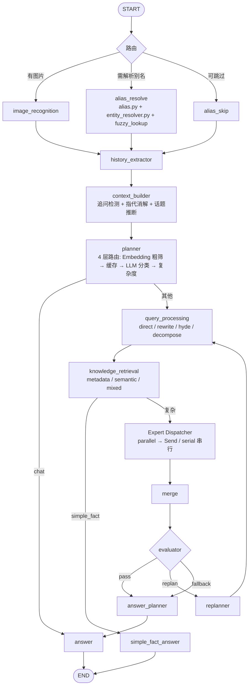

# AniGraph v2.5 — 项目总结

> 本文档描述项目当前实现（v2.5），不保留历史版本演进记录。

## 项目定位

基于 LangGraph 的多 Agent ACG 番剧检索、问答与推荐系统。在约 5,000 部 Bangumi 番剧知识库上，通过结构化元数据索引、向量检索、稀疏检索和联网搜索的组合，实现秒级自然语言问答与推荐。
---

## 系统架构

### 图流程


```mermaid
flowchart TD
    Start([START]) --> RouteStart{路由}
    RouteStart -- 有图片 --> Image[image_recognition]
    RouteStart -- 需解析别名 --> Alias[alias_resolve<br/>alias.py + entity_resolver.py + fuzzy_lookup]
    RouteStart -- 可跳过 --> Skip[alias_skip]
    Image --> Hist[history_extractor]
    Alias --> Hist
    Skip --> Hist
    Hist --> Ctx[context_builder<br/>追问检测 + 指代消解 + 话题推断]
    Ctx --> Planner[planner<br/>4 层路由: Embedding 粗筛 → 缓存 → LLM 分类 → 复杂度]
    Planner -- chat --> Answer[answer]
    Planner -- 其他 --> QP[query_processing<br/>direct / rewrite / hyde / decompose]
    QP --> KR[knowledge_retrieval<br/>metadata / semantic / mixed]
    KR -- simple_fact --> SF[simple_fact_answer] --> End([END])
    KR -- 复杂 --> Dispatch[Expert Dispatcher<br/>parallel → Send / serial 串行]
    Dispatch --> Merge[merge]
    Merge --> Eval{evaluator}
    Eval -- pass --> AP[answer_planner]
    Eval -- replan --> Replan[replanner] --> QP
    Eval -- fallback --> AP
    AP --> Answer
    Answer --> End
```

### 关键设计

- **ExecutionPlan 驱动编排**：Planner 输出 ExecutionPlan（query_type / experts / parallel / rewrite_strategy / query_category / need_web），图引擎根据计划自动路由
- **按需节点调度**：alias_resolve、web_fallback、image_recognition 只在需要时加入执行路径
- **三路检索**：Metadata Index（结构化过滤）+ Pinecone（语义向量）+ Whoosh（BM25F 稀疏检索），RRF 融合 + 可选 CrossEncoder 精排
- **Simple Fact 快速通道**：query_type == "simple_fact" 时跳过 Expert → Merge → Answer 流水线，一次 LLM 调用直接回答
- **证据质量闭环**：Merge 后 Evaluator 评估证据（确定性规则优先，冲突时调小模型），MAX_REPLANS 默认关闭（0），可配置最多一次重规划
- **SessionStore**：main.py / chat.py / server.py 共用 agents/session_store.py，同一 thread_id 共享 MemorySaver 与已编译图实例

---

## 模块清单

### agents/ — Agent 节点

| 模块 | 功能 | LLM 调用 |
|------|------|:--------:|
| graph.py | 图定义 + 路由函数 | 0 |
| state.py | AgentState / ExecutionPlan / ExpertResult / EvaluationResult | 0 |
| alias_resolve.py | 别名/实体解析节点（按需） | 0–2 |
| alias.py | 别名词典 + LLM 推断 | 0–1 |
| entity_resolver.py | 角色/梗名识别 | 0–1 |
| history_extractor.py | 从 messages 提取最近 N 轮对话历史 | 0 |
| context_builder.py | 追问检测 + 指代消解 + 话题推断 + history 预拼接 | 0 |
| planner.py | 4 层路由（Embedding 预过滤 → 缓存 → LLM 分类 → 复杂度分析）→ ExecutionPlan | 1 |
| query_processor.py | 查询优化（direct / rewrite / hyde / decompose） | 0–1 |
| retrieval.py | 知识检索（metadata / semantic / mixed 三路径） | 0 |
| metadata_fallbacks.py | Simple Fact 与全流程共享的检索兜底（studio_year / title / filter） | 0 |
| metadata_reasoner.py | 元数据推理 Expert | 1 |
| similar_expert.py | 相似推荐 Expert | 1 |
| simple_fact_answer.py | 简单事实快速通道 | 1 |
| merge.py | 结果合并去重 | 0 |
| evaluator.py | 证据质量评估（确定性规则 + 可选 LLM 冲突检查） | 0–1 |
| replanner.py | 受限重规划（只修正检索策略与 Expert 组合） | 0 |
| answer_planner.py | 回答结构规划（随机选择，零 LLM 成本） | 0 |
| answer.py | 最终回答生成 | 1 |
| web_fallback.py | 联网回退（Tavily） | 0–1 |
| image_recognition.py | 截图识别（trace.moe + VLM fallback） | 0–1 |
| metadata_index.py | Metadata Index 局部搜索 + fuzzy_lookup 管道匹配 | 0 |
| session_store.py | 统一会话记忆管理（MemorySaver + 图实例池） | 0 |
| prompts.py | 共享 Prompt 组件（禁止清单 / 上下文构建） | 0 |
| cache.py | 缓存工具 | 0 |
| message_content.py | 消息内容工具 | 0 |

### tools/ — 检索工具

| 模块 | 功能 |
|------|------|
| registry.py | ToolRegistry 统一注册表（12 个工具懒加载 / 开关控制） |
| rag.py | Pinecone retriever 工厂（similarity 默认，可选 MMR） |
| rag_optimizer.py | 检索优化管线 |
| web_search.py | Tavily 联网搜索 |
| image_search.py | trace.moe API 客户端 |

### trace/ — Traced 数据采集

| 模块 | 功能 |
|------|------|
| collector.py | astream_events(version="v2") 事件收集器 |
| adapter.py | LangGraph 事件 → 前端 TraceEvent 格式适配 |
| models.py | TraceEvent / NodeInfo / NodeRuntime / LLMTrace 类型 |
| pricing.py | DeepSeek Token 计价 |

### 入口文件

| 文件 | 功能 |
|------|------|
| main.py | run() 单次查询 + run_stream() 流式 Trace |
| chat.py | 交互式终端 |
| server.py | FastAPI Web Trace Server（SSE） |
| config.py | 全局配置 + 校验 |
| llms.py | LLM / Embedding 实例 + 重试机制 |

---

## Routing 逻辑

| 路由点 | 函数 | 逻辑 |
|--------|------|------|
| START 后 | _route_from_start | 有图 → image_recognition；should_skip_alias → alias_skip；否则 alias_resolve |
| Planner 后 | _route_after_planner | chat → answer；其余 → query_processing |
| 检索后 | _route_after_retrieval | simple_fact → 快速通道；0 Expert → answer_planner；多 Expert 按 parallel 进入 Send 或 serial_expert |
| Evaluator 后 | _route_after_evaluator | pass → web 判断/answer；replan 且有预算 → replanner；fallback/耗尽 → web 或降级回答 |

---

## Tech Stack

| 层级 | 技术 |
|------|------|
| 编排框架 | LangGraph 1.2+ |
| 主 LLM | DeepSeek-V4-Pro |
| 轻量 LLM | DeepSeek-V4-Flash |
| Web Server | FastAPI + uvicorn + SSE |
| 向量检索 | Pinecone (similarity / MMR) |
| 稀疏检索 | Whoosh (BM25F) |
| 精排 | bge-reranker-v2-m3 |
| 嵌入模型 | Ark Coding Plan doubao-embedding-vision（默认）/ local Qwen3 / DashScope |
| 结构化索引 | JSON MetadataIndex |
| 联网搜索 | Tavily |

---

## 测试

```bash
# 无依赖单元测试
pytest -q tests/test_config.py tests/test_quality_loop.py tests/test_retry_system.py \
          tests/test_chunking.py tests/test_planner_fast_path.py \
          tests/test_streaming.py tests/test_constraints.py

# 需要 LLM/Pinecone 配置的集成测试
pytest -q tests/test_agent.py tests/test_architecture.py \
          tests/test_alias_layered.py tests/test_rag_optimizer.py \
          tests/test_ark_embeddings.py

# 消融实验 / Hard Eval
python tests/ablation.py --dry-run
python tests/run_full_pipeline.py
python tests/run_hard_ablation.py
```

---

## 关键配置

| 变量 | 默认值 | 说明 |
|------|--------|------|
| LLM_MODEL | deepseek-v4-pro | 主 LLM |
| SIMPLE_LLM_MODEL | deepseek-v4-flash | 轻量 LLM |
| EMBEDDING_BACKEND | ark | ark / local / dashscope |
| PINECONE_SEARCH_TYPE | similarity | similarity / mmr |
| RETRIEVER_K | 5 | 最终返回文档数 |
| HYBRID_DENSE_K | 20 | Pinecone 检索数 |
| HYBRID_SPARSE_K | 20 | Whoosh 检索数 |
| RERANK_TOP_K | 10 | 精排候选数 |
| MAX_REPLANS | 0 | 最大重规划次数（硬上限 1） |
| ENABLE_RERANKING | false | CrossEncoder 精排开关 |
| ENABLE_WEB_SEARCH | true | Tavily 联网搜索开关 |
| MEMORY_MAX_ROUNDS | 5 | 保留最近 N 轮对话 |

---

## 已知限制

- 无增量索引更新，新增番剧需全量重建
- MemorySaver 为进程内，重启丢失
- 无 GPU 推理，CrossEncoder 在 CPU 上较慢
- 无自动回归测试
