# AniGraph — ACG 番剧智能检索与推荐系统 v2.5

基于 LangGraph 的多 Agent 动漫问答系统。它把结构化元数据、向量检索、关键词检索和联网搜索组合在一条动态工作流中，支持事实查询、推荐、对比、多轮追问和动漫截图识别，并提供 Web Trace 实时执行面板。

```
用户: "无职转生的主角是谁？"
AniGraph: 鲁迪乌斯·格雷拉特，声优是内山夕实。原作是理不尽な孫の手写的轻小说...
```

---

## 特性

- **多 Agent 协作**：Planner 编排 → Expert 按计划并行或串行推理 → 证据评估 → 融合回答
- **4 层路由**：Embedding 粗筛（质心匹配）→ 缓存 → LLM 意图分类 → 复杂度分析
- **按需节点调度**：alias_resolve 和 web_fallback 按需加入，各节点可独立开关
- **Hybrid RAG**：Metadata Index（结构化）+ Pinecone（语义）+ Whoosh（关键词）三路检索
- **Simple Fact 快速通道**：简单事实查询单次 LLM 直接回答，跳过 Expert 流水线
- **对话上下文感知**：支持多轮追问、指代消解（"它的评分""第二部呢"），缓存键含 history 防误命中
- **ToolRegistry**：统一工具注册表，12 个工具集中管理、懒加载、开关控制
- **LLM 健壮性**：Structured Output 自动降级 + tenacity 指数退避重试（覆盖全部 13 处调用点）
- **Evaluator-Replan 闭环**：Merge 后先评估证据质量，失败时最多重规划一次（默认关闭，`MAX_REPLANS=0`）
- **共享 Prompt 组件**：`agents/prompts.py` 统一禁止清单和上下文构建，避免重复
- **Web Trace 面板**：SSE 实时推送执行过程——聊天气泡 + 流程图，每个节点的 LLM Token 用量一目了然
- **动漫截图识别**：上传 JPEG/PNG/WebP，优先调用 trace.moe；低置信度时可选用 VLM 补充识别
- **SessionStore 统一**：`main.py` / `chat.py` / `server.py` 共用 `SessionStore`，同一 `thread_id` 共享 `MemorySaver` 与已编译图实例

---

## 快速开始

### 1. 环境配置

```bash
# 克隆项目
git clone <repo-url> && cd AniGraph

# 安装依赖（推荐 uv）
uv pip install -r requirements.txt

# 配置 .env
cp .env.example .env
# 编辑 .env，至少填入 LLM、Embedding、Pinecone 和 Tavily 所需密钥
```

默认使用 Ark Coding Plan 的 `doubao-embedding-vision`（1024 维）。如需本地 embedding，将 `EMBEDDING_BACKEND` 改为 `local`；如需 DashScope，将其改为 `dashscope`。切换模型后不得复用维度不一致的 Pinecone 索引。

启动时 `config.validate()` 会检查必填配置。当前实现将 `TAVILY_API_KEY` 也视为必填，即使关闭联网搜索也不能省略。

### 2. 构建知识库

```bash
python data/build_kb.py --metadata-only    # 构建 Metadata Index
python data/build_kb.py --whoosh-only      # 构建 Whoosh 索引
python data/build_kb.py                    # 构建 Pinecone 向量库
```

构建脚本读取 `data/anime_data.db`。向量和 Whoosh 索引共用分块规则，将每部番剧拆成 `profile`、`staff`、`cast` 和 `reviews` 等语义块。断点续跑使用 `python data/build_kb.py --resume`。

### 3a. Web Trace 面板（推荐）

```bash
python server.py
# 打开 http://localhost:9527
```

左侧聊天面板输入查询，右侧实时显示流程图——每个节点的执行状态、耗时、LLM Token 用量流式推送。面板同时支持文字查询和截图上传。截图识别依赖公网访问 trace.moe；VLM fallback 只有在配置 `VLM_API_KEY` 后才可用。

### 3b. 命令行交互

```bash
python main.py
# 或指定会话
python main.py --session demo
```

### 3c. Python 调用

```python
import asyncio
from main import run

answer = asyncio.run(run("推荐一部科幻悬疑番", thread_id="demo"))
print(answer)
```

---

## 架构

```mermaid
flowchart TD
    Start([用户查询 / 图片上传]) --> RouteStart{路由}
    RouteStart -- 有图 --> Image[image_recognition<br/>trace.moe + VLM]
    RouteStart -- 低风险 --> Skip[alias_skip]
    RouteStart -- 按需 --> Alias[alias_resolve<br/>别名词典 → LLM → fuzzy_lookup]
    Image --> Hist[history_extractor]
    Skip --> Hist
    Alias --> Hist
    Hist --> Ctx[context_builder<br/>追问检测 + 指代消解 + 话题推断]
    Ctx --> Planner[planner<br/>Embedding 粗筛 → 缓存 → LLM 分类 → 复杂度]
    Planner -- chat --> Answer[answer]
    Planner -- 其他 --> QP[query_processing<br/>direct / rewrite / hyde / decompose]
    QP --> KR[knowledge_retrieval<br/>metadata / semantic / mixed]
    KR -- simple_fact --> SF[simple_fact_answer] --> End([END])
    KR -- 复杂查询 --> Dispatch{Expert Dispatcher}
    Dispatch -- parallel=true --> Parallel[Send&#40;experts&#41; 并行]
    Dispatch -- parallel=false --> Serial[experts 顺序串行]
    Dispatch -- 单 Expert --> Single[直接执行]
    Parallel --> Merge[merge]
    Serial --> Merge
    Single --> Merge
    Merge --> Eval{evaluator}
    Eval -- pass --> WebOrAnswer[web 判断 → answer]
    Eval -- replan --> Replan[replanner] --> QP
    Eval -- fallback/exhausted --> Degrade[降级回答]
    WebOrAnswer --> Answer
    Answer --> End
    Degrade --> End
```



详细节点说明见 [架构文档](docs/architecture.md)。

---

## 项目结构

```
AniGraph/
├── main.py                # 入口：run() / run_stream() + 终端
├── chat.py                # 交互式终端 Chat
├── server.py              # FastAPI Web Trace Server
├── config.py              # 全局配置 + 校验
├── llms.py                # LLM / Embedding 实例
├── static/                # 前端静态文件
│   ├── index.html         # Web Trace 面板
│   ├── app.js             # SSE 客户端 + 聊天 + 流程图
│   └── style.css          # 样式
├── trace/                 # Trace 数据采集模块
│   ├── collector.py       # astream_events 事件收集器
│   ├── adapter.py         # LangGraph 事件 → 前端格式适配
│   ├── models.py          # TraceEvent / NodeInfo 等类型定义
│   └── pricing.py         # DeepSeek Token 计价
├── agents/                # Agent 节点
│   ├── graph.py           # 图定义 + 路由函数
│   ├── state.py           # AgentState / ExecutionPlan / ExpertResult
│   ├── alias_resolve.py   # 别名/实体解析节点
│   ├── alias.py           # 别名词典 + LLM 推断
│   ├── entity_resolver.py # 角色/梗名识别
│   ├── history_extractor.py   # 对话历史提取
│   ├── context_builder.py     # 追问检测 + 指代消解
│   ├── planner.py         # 4 层路由 → ExecutionPlan
│   ├── query_processor.py # 查询优化（direct / rewrite / hyde / decompose）
│   ├── retrieval.py       # 知识检索（metadata / semantic / mixed）
│   ├── metadata_fallbacks.py  # 共享检索兜底（studio_year / title / filter）
│   ├── metadata_reasoner.py   # 元数据推理 Expert
│   ├── similar_expert.py      # 相似推荐 Expert
│   ├── simple_fact_answer.py  # 快速通道回答
│   ├── merge.py           # 结果合并去重
│   ├── evaluator.py       # 证据质量评估
│   ├── replanner.py       # 受限重规划
│   ├── answer_planner.py  # 回答结构规划（零 LLM）
│   ├── answer.py          # 最终回答生成
│   ├── web_fallback.py    # 联网回退
│   ├── image_recognition.py   # 截图识别
│   ├── metadata_index.py      # Metadata Index 局部搜索
│   ├── session_store.py       # 会话记忆管理
│   ├── cache.py           # 缓存工具
│   ├── message_content.py # 消息内容工具
│   └── prompts.py         # 共享 Prompt 组件
├── tools/                 # 检索工具
│   ├── registry.py        # ToolRegistry 统一注册表
│   ├── rag.py             # Pinecone retriever 工厂
│   ├── rag_optimizer.py   # 检索优化
│   ├── web_search.py      # Tavily 联网搜索
│   └── image_search.py    # trace.moe API 客户端
├── scripts/               # 辅助脚本
│   ├── audit_seed.py      # 种子数据审计
│   ├── bench_planner.py   # Planner 性能基准
│   ├── fetch_aliases.py   # 别名词典抓取
│   ├── inspect_db.py      # 数据库检查
│   └── smoke_*.py         # 冒烟测试
├── docs/                  # 文档
│   ├── architecture.md    # 架构文档
│   ├── api.md             # HTTP / Python 接口文档
│   ├── api_reference.md   # 内部 Python 模块参考
│   ├── ablation_report.md # 消融实验报告
│   ├── failure_case.md    # 失败用例分析（多轮）
│   └── failure_case_hard.md # Hard Eval 失败分析
├── tests/                 # 测试与评测
│   ├── test_*.py          # 单元测试
│   ├── ablation.py        # 消融实验框架
│   ├── run_*.py           # 评测运行脚本
│   ├── eval_dataset.json  # 评测数据集
│   └── *_results.json     # 评测结果
├── data/                  # 知识库数据（.gitignore）
├── .env.example           # 环境变量模板
├── requirements.txt       # Python 依赖
└── LICENSE                # MIT
```

---

## Web Trace 面板

| 功能 | 说明 |
|------|------|
| SSE 实时推送 | 节点开始/结束、LLM Token 用量、回答文本流式传输 |
| 聊天气泡 | 左栏对话式 UI，打字机流式输出 |
| 流程图 | 右栏显示完整执行链路，每个节点标注耗时和 LLM 调用情况 |
| 节点详情 | 点击节点查看 State 变化、LLM 调用明细 |
| 模型信息 | 显示当前 LLM / Embedding 配置（只读） |

**启动**：`python server.py` → http://localhost:9527

**API 端点**：
- `GET /` — Web 面板
- `POST /chat/stream` — SSE 流式对话（主接口）
- `GET /chat/stream?query=...&thread_id=...` — SSE 流式对话（GET 调试版）
- `POST /chat/image` — 截图上传 + SSE 流式输出
- `GET /api/models` — 返回 LLM / Embedding 配置对象
- `GET /api/health` — 健康检查（仅报告进程存活）

---

## 技术栈

| 层级 | 技术 |
|------|------|
| 编排框架 | LangGraph 1.2+ |
| 主 LLM | DeepSeek-V4-Pro |
| 轻量 LLM | DeepSeek-V4-Flash |
| Web Server | FastAPI + uvicorn + SSE |
| 向量检索 | Pinecone (similarity / MMR) |
| 稀疏检索 | Whoosh (BM25F) |
| 精排 | bge-reranker-v2-m3 |
| 嵌入模型 | Ark Coding Plan `doubao-embedding-vision`（默认）/ local Qwen3 / DashScope |
| 结构化索引 | JSON MetadataIndex |
| 联网搜索 | Tavily |

---

## 配置约束

验证逻辑见 `config.validate()` 和 `config.validate_retrieval_settings()`：

- `RETRIEVER_FETCH_K >= HYBRID_DENSE_K`（MMR 粗召回池必须覆盖密集检索量）
- `HYBRID_DENSE_K >= RETRIEVER_K` 且 `HYBRID_SPARSE_K >= RETRIEVER_K`（密集/稀疏检索量须 ≥ 最终返回数）
- `RERANK_TOP_K >= RETRIEVER_K`（精排候选数须 ≥ 最终返回数）
- Ark Coding Plan 固定 `doubao-embedding-vision`、1024 维，不得切换模型或维度
- `PINECONE_SEARCH_TYPE` 必须为 `"similarity"` 或 `"mmr"`；`mmr` 模式下 `RETRIEVER_FETCH_K` 须 ≥ `HYBRID_DENSE_K`
- 记忆系统为进程内 `MemorySaver`，重启清空；同一 `thread_id` 共享 in-process 实例
- `/api/health` 仅报告进程存活，不检查 Pinecone / Tavily / LLM 连通性

---

## 测试

```bash
# 无依赖单元测试
pytest -q tests/test_config.py tests/test_quality_loop.py tests/test_retry_system.py \
          tests/test_chunking.py tests/test_planner_fast_path.py \
          tests/test_streaming.py tests/test_constraints.py

# 需要 LLM/Pinecone 配置的集成测试
pytest -q tests/test_agent.py tests/test_architecture.py \
          tests/test_alias_layered.py tests/test_rag_optimizer.py \
          tests/test_ark_embeddings.py

# 消融实验 / Hard Eval
python tests/ablation.py --dry-run   # 预览实验矩阵
python tests/run_full_pipeline.py    # 全流程评测
python tests/run_hard_ablation.py    # Hard Eval 消融
```

> 注意：集成测试依赖 `pytest-asyncio` 与真实 API 配置，需额外安装并配好 `.env`。

---

## 更多文档

- [架构文档](docs/architecture.md) — 节点详解、State Schema、路由逻辑
- [外部接口文档](docs/api.md) — HTTP API、Python API、TraceEvent 结构
- [内部 API 参考](docs/api_reference.md) — 模块级 Python 接口参考
- [消融实验报告](docs/ablation_report.md) — 数据集设计、变体、结论
- [失败用例分析](docs/failure_case.md) — 指代漂移、跨轮约束等典型问题修复
- [Hard Eval 失败分析](docs/failure_case_hard.md) — RAG 召回缺失、知识库字段缺失等根因
