# AniGraph 架构文档

> 外部 HTTP / Python 接入见 [接口文档](api.md)，内部模块与状态字段见 [Python API 参考](api_reference.md)。

## 概述

AniGraph 是一个基于 LangGraph 的多 Agent ACG 番剧检索、问答与推荐系统。核心采用 **ExecutionPlan 驱动编排** 的设计：Planner 输出一份执行计划，图引擎根据计划自动选择检索路径、Expert 组合和回答策略；截图请求先经过独立的识图节点。

### 关键特性

- **检索层拆分**：`agents/retrieval.py` 汇聚所有检索逻辑，`tools/rag.py` 降级为纯工具
- **metadata_fallbacks 共享**：Simple Fact 快速通道与全流程共享 `fetch_by_studio_year` / `fetch_by_title` / `filter_metadata_by_query` 兜底规则
- **SessionStore 统一**：`main.py` / `chat.py` / `server.py` 共用 `agents/session_store.py` 的 `SessionStore`，同一 `thread_id` 的 `MemorySaver` 与已编译图实例复用
- **answer_planner 独立**：零 LLM 成本回答结构规划器，随机选结构避免千篇一律
- **query_processing 独立**：查询优化节点从 `tools/query_processing.py` 迁入 `agents/query_processor.py`
- **alias_resolve 管道式**：别名解析与实体识别拆为 `alias.py` + `entity_resolver.py`，新增 `metadata_index.fuzzy_lookup` 管道匹配
- **默认 PINECONE_SEARCH_TYPE=similarity**：实测 MMR 延迟约 29s 而 similarity 仅约 1.4s，降维后的 RRF 融合 + 去重压缩已能处理多样性
- **MAX_REPLANS 默认 0**：默认关闭重规划，由 `MAX_REPLANS` 环境变量控制（硬上限 1）

---

## 图流程

```mermaid
flowchart TD
    Start([START]) --> RouteStart{route_from_start}
    RouteStart -- 有图片 --> Image[image_recognition]
    RouteStart -- 需解析别名 --> Alias[alias_resolve]
    RouteStart -- 可跳过 --> Skip[alias_skip]
    Image --> Hist[history_extractor<br/>最近 N 轮对话历史]
    Alias --> Hist
    Skip --> Hist
    Hist --> Ctx[context_builder<br/>追问检测 / 指代消解 / 话题推断]
    Ctx --> Planner[planner<br/>4 层路由 → ExecutionPlan]
    Planner --> RoutePlanner{route_after_planner}
    RoutePlanner -- chat --> Answer[answer]
    RoutePlanner -- 其他 --> QP[query_processing<br/>direct / rewrite / hyde / decompose]
    QP --> KR[knowledge_retrieval<br/>metadata / semantic / mixed]
    KR --> RouteRet{route_after_retrieval}
    RouteRet -- simple_fact --> SF[simple_fact_answer] --> End([END])
    RouteRet -- 无 Expert --> AP[answer_planner]
    RouteRet -- parallel=true --> Parallel[Send&#40;experts&#41; 并行]
    RouteRet -- parallel=false --> Serial[serial_expert 顺序循环]
    RouteRet -- 单 Expert --> Single[直接执行]
    Parallel --> Merge[merge<br/>仅当前 attempt]
    Serial --> Merge
    Single --> Merge
    Merge --> Eval{evaluator}
    Eval -- pass --> WebGate[web 判断]
    Eval -- replan --> Replan[replanner] --> QP
    Eval -- fallback/exhausted --> Degrade[降级回答]
    WebGate --> AP
    AP --> Answer
    Degrade --> Answer
    Answer --> End
```



`chat` 与 `simple_fact` 是显式快速通道，不进入质量闭环。普通查询的 Expert 结果按 `execution_id + attempt` 隔离，避免不同请求或重规划轮次的结果污染 Merge。

### Web Trace 面板

**文件**：`server.py` + `static/` + `trace/`

基于 FastAPI + SSE（Server-Sent Events）的实时执行追踪面板：
- `GET /` — Web 面板（聊天气泡 + 流程图）
- `POST /chat/stream` — SSE 流式推送节点事件 + LLM Token + 回答文本
- `GET /chat/stream?query=...` — 行为相同的 GET 调试变体
- `POST /chat/image` — JPEG / PNG / WebP 截图上传 + SSE 输出
- `GET /api/models` / `GET /api/health`

**trace/ 模块**：

| 文件 | 职责 |
|------|------|
| `collector.py` | 单一 `astream_events(version="v2")` 流收集所有事件 |
| `adapter.py` | LangGraph 事件 → 前端 TraceEvent 格式适配 |
| `models.py` | TraceEvent / NodeInfo / NodeRuntime / LLMTrace 类型 |
| `pricing.py` | DeepSeek Token 计价（$0.55 / $2.19 per 1M） |

**启动**：`python server.py` → http://localhost:9527

---

## 路由函数

**`_route_from_start(state)`**

根据 `state.image_data` 和 `config.ENABLE_ALIAS_RESOLVE` 决定首节点：有图片 → `image_recognition`；别名解析开关关闭 → `alias_skip`；否则进入 `alias_resolve` 完成别名/实体解析后再走 `history_extractor`。

**`_route_after_planner(state)`**

根据 `plan.query_type` 分流：`chat` → 直达 `answer`（闲聊不走检索）；其余 → `query_processing`。

**`_route_after_retrieval(state)`**

三层分流：`simple_fact` → 快速通道 `simple_fact_answer` → END；`experts` 为空 → `answer_planner`（零 Expert 场景直接规划回答结构）；多 Expert 则按 `plan.parallel` 进入 `Send(experts)` 并行分支或 `serial_expert` 串行循环。

**`_route_after_serial_expert(state)` / `_route_after_similar_expert(state)`**

单个 Expert 完成后的判断：`expert_results` 中还有未执行 Expert 则继续串行；否则进入 `merge`。

**`_route_after_merge(state)`**

Merge 后始终进入 `evaluator`。

**`_route_after_evaluator(state)`**

根据 `evaluation.verdict` 终结：`pass` → 判断是否需要 `web_fallback` 补充 → `answer_planner`；`replan` 且未耗尽重规划次数 → `replanner`（重新规划后回到 `query_processing`）；`fallback` 或 `exhausted` → 降级回答。

---

## AgentState 概览

| 字段 | 类型 | 说明 |
|------|------|------|
| `messages` | list | 对话消息历史 |
| `image_data` | str | 可选 base64 截图 |
| `plan` | ExecutionPlan | Planner 输出 |
| `conversation_context` | ConversationContext | 追问/指代消解结果 |
| `query_text` | str | 经 alias_resolve 消解后的查询文本 |
| `expert_results` | dict[str, list[ExpertResult]] | Expert 执行结果（key: execution_id） |
| `evaluation` | EvaluationResult | Evaluator 输出 |
| `replan_count` | int | 已重规划次数 |
| `execution_id` | str | 当前请求唯一标识 |
| `quality_trace` | list | 质量评估与 plan diff 事件 |
| `termination_reason` | str | 执行终止原因 |
| `errors` | list[str] | 执行过程中的错误记录 |

**ExecutionPlan**（BaseModel）：`query_type` / `query_category` / `experts` / `parallel` / `rewrite_strategy` / `need_web` / `need_web_fallback`

**ExpertResult**：`expert_name` / `content` / `evidence` / `confidence` / `metadata`

**EvaluationResult**：`verdict`（pass / replan / fallback）/ `reason` / `missing_dimensions` / `suggestions`

---

## 数据流示例

用户输入 "推荐一部类似命运石之门的科幻番"：

1. **alias_resolve**：检测"命运石之门"已知别名 → 直接映射，fuzzy_lookup 命中
2. **history_extractor**：提取最近 5 轮对话历史（本轮为空）
3. **context_builder**：无追问/指代，构建简单上下文
4. **planner**：Embedding 粗筛通过 → 缓存未命中 → LLM 分类为 `complex_recommendation` → 复杂度分析为中 → 规划 Expert `similar_expert`、`parallel=true`
5. **query_processing**：rewrite 策略优化查询
6. **knowledge_retrieval**：mixed 路径检索 Metadata Index + Pinecone + Whoosh，RRF 融合
7. **similar_expert**（并行）：基于检索结果推理相似推荐
8. **merge**：合并结果去重
9. **evaluator**：确定性规则检查通过，verdict=pass
10. **answer_planner**：随机选择推荐回复结构
11. **answer**：生成最终回答
12. **done**：推送汇总信息

---

## 项目结构

```
AniGraph/
├── main.py                 # 入口：run() / run_stream()
├── chat.py                 # 交互式终端
├── server.py               # FastAPI Web Trace Server
├── config.py               # 全局配置 + 校验
├── llms.py                 # LLM / Embedding 实例 + 重试
├── static/                 # 前端（index.html / app.js / style.css）
├── trace/                  # Trace 数据采集（collector / adapter / models / pricing）
├── agents/                 # 25 个 Agent 节点 + 工具模块
├── tools/                  # 检索工具（registry / rag / web_search / image_search）
├── data/                   # 知识库数据（.gitignore）
├── docs/                   # 文档
├── tests/                  # 测试与评测
├── scripts/                # 辅助脚本
├── .env.example
├── requirements.txt
└── LICENSE
```

---

## 技术栈

| 层级 | 技术 |
|------|------|
| 编排框架 | LangGraph 1.2+ |
| 主 LLM | DeepSeek-V4-Pro |
| 轻量 LLM | DeepSeek-V4-Flash |
| Web Server | FastAPI + uvicorn + SSE |
| 向量检索 | Pinecone (similarity / MMR) |
| 稀疏检索 | Whoosh (BM25F) |
| 精排 | bge-reranker-v2-m3 |
| 嵌入模型 | doubao-embedding-vision（Ark Coding Plan）/ Qwen3（local）/ DashScope |
| 结构化索引 | JSON MetadataIndex |
| 联网搜索 | Tavily |
